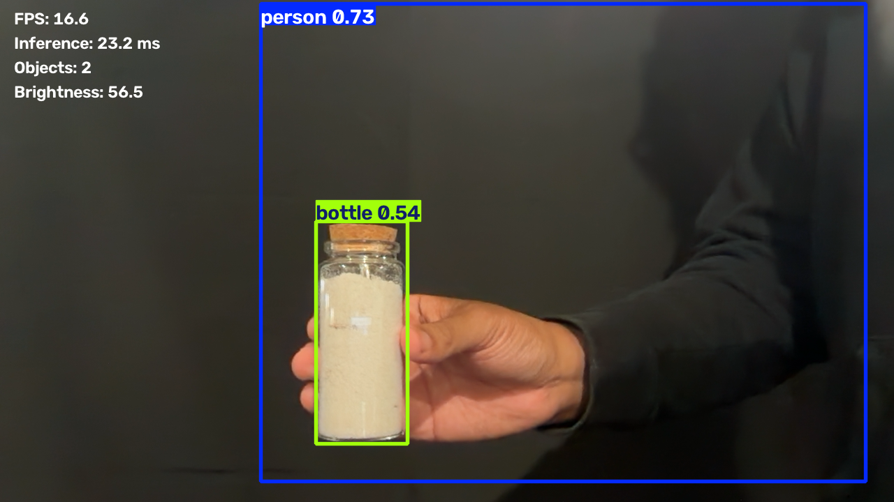
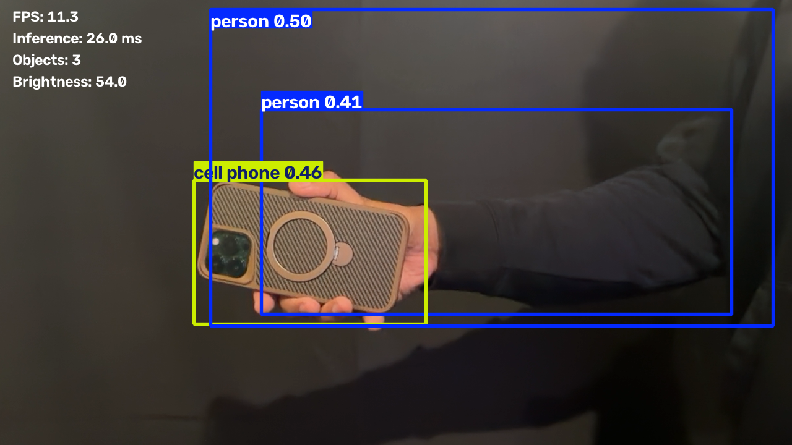
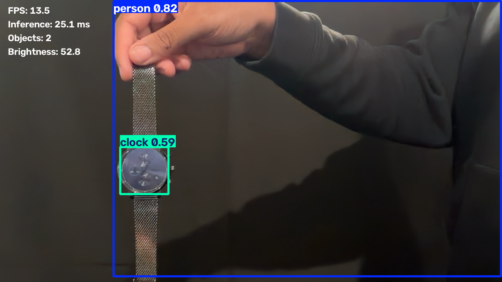
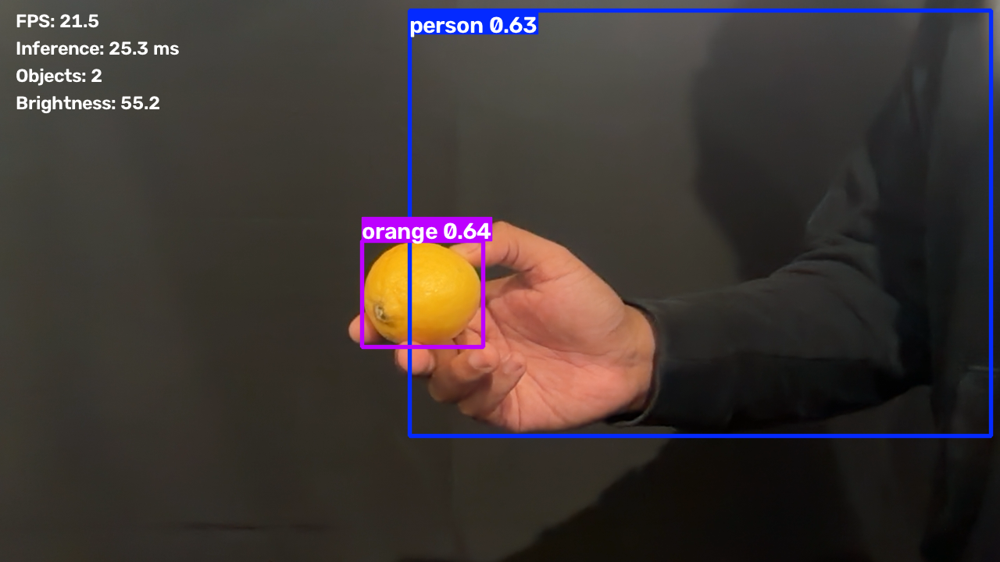
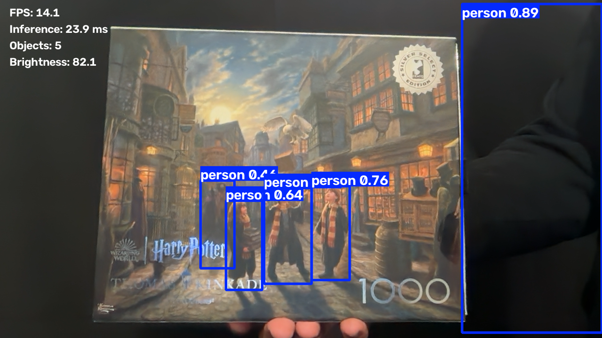
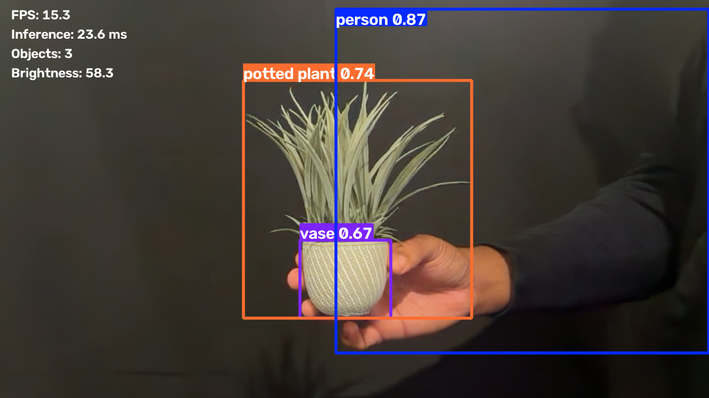
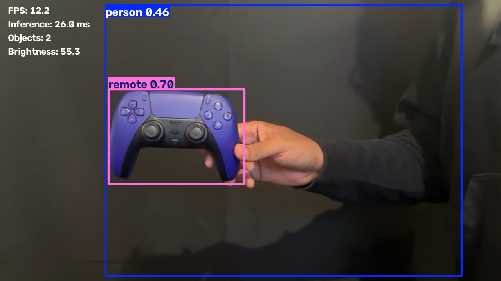
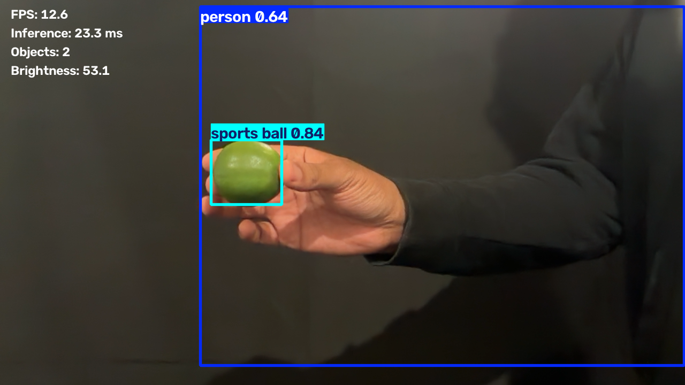

# Real-Time Object Detection with YOLOv8

# YOLO Real-Time Object Detection

Real-time object detection using YOLOv8, OpenCV, and a MacBook webcam.

## Project Resources

- 📄 IEEE Pape
- 💻 Source Code
- 📊 Runtime Metrics
- 🖼 Detection Example

> High-performance real-time object detection using YOLOv8, OpenCV, and Python with live webcam inference, runtime performance monitoring, automatic screenshot capture, and detection analytics.


---

## Overview

This project implements a real-time object detection pipeline using the **Ultralytics YOLOv8** model and **OpenCV**. The application performs live inference using a webcam, detects objects from the COCO dataset, overlays bounding boxes and confidence scores, and records runtime performance metrics.

Unlike offline image classification examples, this implementation focuses on an end-to-end deployment workflow including:

- Live webcam inference
- Multi-object detection
- Automatic object labeling
- Runtime performance monitoring
- Screenshot capture
- Detection analytics
- Performance logging

The project demonstrates practical deployment of modern deep learning-based object detection on consumer hardware.

---

## Features

- Real-time object detection using YOLOv8
- Live webcam video processing
- Automatic bounding box generation
- COCO object classification
- Confidence score visualization
- FPS monitoring
- Inference latency measurement
- Brightness estimation
- Object count tracking
- Screenshot capture
- Runtime CSV logging
- Video recording support
- Cross-platform Python implementation

---

## Detection Examples

### Bottle Detection



### Cell Phone Detection



### Clock Detection



### Orange Detection



### Person Detection



### Potted Plant and Vase Detection



### Remote Detection



### Misclassification Example

The model classified a lime as a sports ball. This example demonstrates a limitation of using a general-purpose pretrained COCO model.



## Repository Structure

```
YOLO_Object_Detection/
│
├── Code/
│   ├── mac_yolo_detection.py
│   ├── requirements.txt
│
├── outputs/
│   ├── runtime_metrics.csv
│   ├── runtime_summary.csv
│   ├── screenshots/
│
├── Figures/
│
├── README.md
│
└── LICENSE
```

---

## Architecture

```
Webcam
   │
   ▼
OpenCV Video Capture
   │
   ▼
YOLOv8 Inference Engine
   │
   ▼
Bounding Box Generation
   │
   ▼
Object Classification
   │
   ▼
Visualization Layer
   │
   ├── FPS
   ├── Inference Time
   ├── Brightness
   ├── Object Count
   │
   ▼
Runtime Metrics
```

---

## Technologies

| Component | Technology |
|------------|------------|
| Language | Python 3 |
| Deep Learning | YOLOv8 |
| Framework | Ultralytics |
| Computer Vision | OpenCV |
| Numerical Computing | NumPy |
| Visualization | OpenCV |
| Dataset | COCO |
| Development | Visual Studio Code |

---

## Installation

Clone the repository.

```bash
git clone https://github.com/<username>/YOLO_Object_Detection.git

cd YOLO_Object_Detection
```

Create a virtual environment.

```bash
python3 -m venv .venv
```

Activate the environment.

macOS

```bash
source .venv/bin/activate
```

Windows

```powershell
.venv\Scripts\activate
```

Install dependencies.

```bash
pip install -r requirements.txt
```

---

## Running the Project

```bash
python mac_yolo_detection.py
```

The application automatically:

- Opens the webcam
- Loads YOLOv8
- Begins real-time inference
- Displays live detection overlays

---

## Controls

| Key | Action |
|------|--------|
| Q | Quit application |
| S | Save screenshot |
| R | Start/Stop video recording |

---

## Performance Metrics

The application continuously measures:

- Frames Per Second (FPS)
- Inference latency
- Object count
- Detection confidence
- Frame brightness

Metrics are exported automatically to:

```
outputs/runtime_metrics.csv
```

---

## Example Detections

The project successfully detected numerous object categories including:

- Person
- Cell Phone
- Bottle
- Clock
- Sports Ball
- Orange
- Remote
- Potted Plant
- Vase

Screenshots are automatically saved to:

```
outputs/screenshots/
```

---

## Example Output

```
FPS: 16.7

Inference Time:
23.5 ms

Objects Detected:
3

Confidence:
0.84

Brightness:
58.2
```

---

## Model

Model:

```
YOLOv8n
```

Dataset:

```
COCO 2017
```

Approximately 80 object classes are supported by the pretrained model.

---

## Performance

Example runtime observed during testing:

| Metric | Result |
|---------|--------|
| Average FPS | ~16 FPS |
| Average Inference | ~23 ms |
| Resolution | 1280×720 |
| Platform | macOS |
| Detection | Real-Time |

Performance varies depending on hardware and lighting conditions.

---

## Limitations

This implementation uses a pretrained YOLOv8 model and was not fine-tuned for a custom dataset.

Current limitations include:

- Occasional false positives
- Lower confidence under poor lighting
- Small object sensitivity
- Webcam quality limitations
- CPU-only inference

---

## Future Improvements

Potential enhancements include:

- YOLOv11 migration
- GPU acceleration
- TensorRT optimization
- Custom dataset training
- Edge AI deployment
- Raspberry Pi integration
- Sony IMX500 support
- Multi-camera inference
- Object tracking
- Instance segmentation
- Pose estimation
- Semantic segmentation

---

## References

- Ultralytics YOLO
- YOLO: Real-Time Object Detection
- YOLO9000
- YOLOv3
- YOLOv4
- COCO Dataset
- OpenCV Documentation

---

## Author

**Dominique McClaney**

Software Engineer

B.S. Information Technology – Software Development

M.S. Artificial Intelligence 

Interests:

- Artificial Intelligence
- Machine Learning
- Computer Vision
- Deep Learning
- Edge AI
- Autonomous Systems

---

## License

This repository is provided for educational and research purposes.
